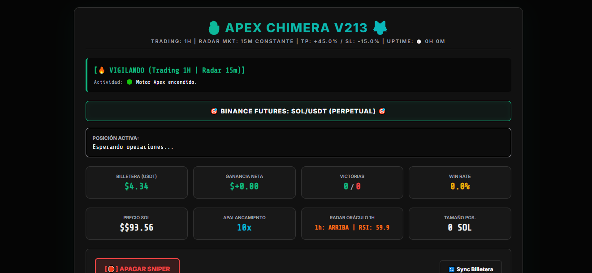

# 🔥 APEX CHIMERA v213 - Trading Bot & Dashboard

Sistema automatizado de trading algorítmico para **Binance Futures** con arquitectura de doble núcleo: ejecución de estrategias en tiempo real y panel de control web dinámico.

## 🚀 Características Principales

- **Arquitectura Dual-Core:** Ejecución de lógica de trading y servidor web en hilos paralelos (`threading`) para asegurar la continuidad operativa.
- **Análisis Técnico Automatizado:** Procesamiento de datos de mercado (Klines) mediante **Pandas** para el cálculo de indicadores (RSI, EMA 9).
- **Gestión de Riesgo:** Ejecución automática de órdenes `MARKET` con `TAKE PROFIT` y `STOP LOSS` calculados dinámicamente.
- **Dashboard Web en Vivo:** Panel de control desarrollado con **Flask** que muestra el PnL, Win Rate, Saldo y estado de la posición en tiempo real.
- **Notificaciones Multi-Canal:** Integración con la API de **Telegram** para el envío de señales y alertas de mercado automáticas.

## 🛠️ Stack Tecnológico

- **Lenguaje:** Python 3.x
- **Librerías Financieras:** `python-binance`, `pandas`
- **Backend Web:** `Flask`
- **Procesamiento:** `Threading` (Multihilo), `Requests`, `Logging`
- **Frontend:** HTML5, CSS3 (Modern Dark UI)

## 📋 Estructura del Proyecto

- `angel_bot_v213.py`: Núcleo principal del bot y lógica de trading.
- `HTML_TEMPLATE`: Plantilla dinámica para el Dashboard web.
- `/logs`: Sistema de registro de actividad y errores para auditoría técnica.

## ⚙️ Configuración

Este proyecto requiere las siguientes variables de entorno para su funcionamiento (configuradas como constantes en el código):

- `API_KEY` (Binance)
- `API_SECRET` (Binance)
- `TOKEN_TELEGRAM` (BotFather)

> **Nota:** Por motivos de seguridad, las credenciales han sido omitidas en este repositorio público.

## 👨‍💻 Autor
**Ángel Luis Espinoza** *Desarrollador Backend & Especialista en Automatización* Especializado en transformar lógica de negocio financiera en soluciones tecnológicas escalables.
